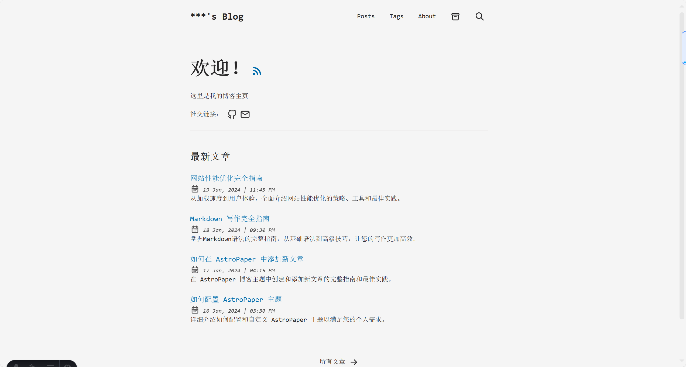
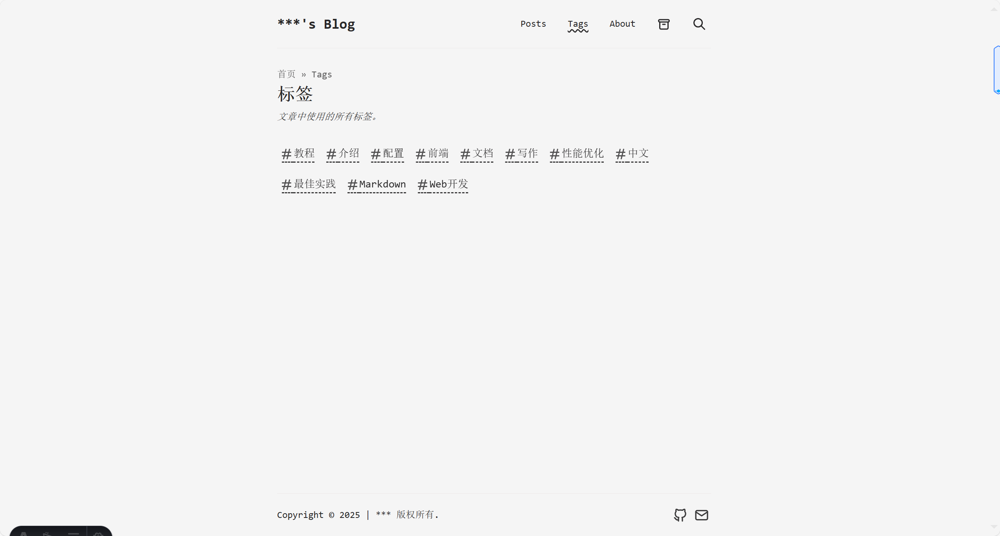
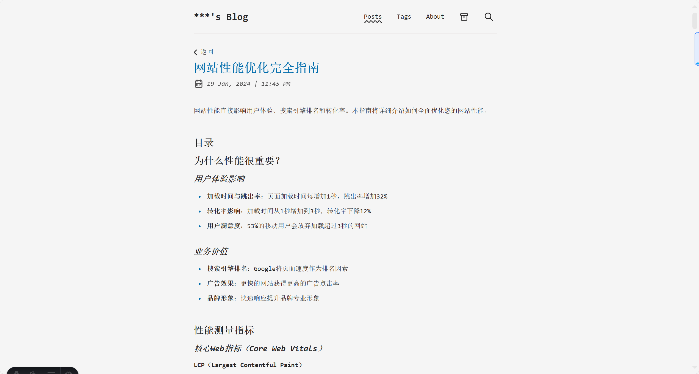
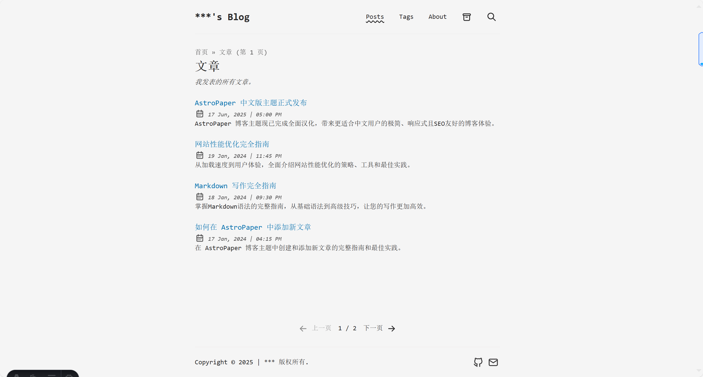

# AstroPaper 博客主题中文版

<p align="center">
  
</p>

<p align="center">
  <a href="https://github.com/satnaing/astro-paper">
    
  </a>
  <a href="https://astro.build/">
    
  </a>
  <a href="https://github.com/your-username/astro-paper-chinese/blob/main/LICENSE">
    
  </a>
</p>

## 🌟 介绍

AstroPaper是一款极简、响应式、SEO友好的博客主题。这个主题基于 [Satnaing](https://github.com/satnaing) 的优秀作品 [AstroPaper](https://github.com/satnaing/astro-paper)，由于原项目是全英文，我对其进行了汉化和必要的注释，让中文用户能够更方便地使用这一优秀的博客主题。

### [📸 查看演示](https://yinxh.fun)

## ✨ 特点

- ⚡ **极速加载** - 基于 Astro 的静态站点生成，保证超快的加载速度
- 🎨 **简约设计** - 专注于内容的极简设计风格
- 📱 **响应式布局** - 完美适配从手机到桌面的各种设备
- 🌓 **明暗主题** - 支持自动和手动切换的明暗模式
- 🔍 **SEO优化** - 内置完善的SEO最佳实践
- 🔎 **站内搜索** - 基于 PageFind 的快速站内搜索功能
- 📄 **Markdown 支持** - 丰富的 Markdown 格式支持，包括代码高亮
- 📑 **站点地图** - 自动生成站点地图
- 📰 **RSS Feed** - 内置 RSS 订阅功能
- 🗃️ **文章分类** - 通过标签组织和筛选内容
- ⚙️ **高度可定制** - 简单的配置文件让你轻松定制网站
- 🇨🇳 **完整中文支持** - 界面和文档全面中文化
- 📖 **中文文档** - 提供全面的中文安装和配置文档

## ⚡ 汉化特点

此次汉化版本具有以下特点：

1. **完整的界面汉化** - 所有菜单、按钮和提示文本均已翻译成中文
2. **中文文档支持** - 提供全面的中文安装和配置文档
3. **本地化优化** - 针对中文内容阅读体验进行了排版优化
4. **保留原有功能** - 完整保留原版主题的所有强大功能

## 🖼️ 界面预览

<details>
<summary>📸 点击查看截图</summary>

### 首页视图


### 标签分类页


### 文章详情页


### 文章列表页


</details>

## 🚀 快速开始

### 前置条件

- Node.js 18 或更高版本
- 包管理器 (推荐使用 pnpm)

### 步骤 1: 克隆仓库

```bash
git clone https://github.com/yinxhhhh/AstroBlog-chinese.git
cd AstroBlog-chinese
```

### 步骤 2: 安装依赖

```bash
# 使用 pnpm (推荐)
pnpm install

# 或使用 npm
npm install

# 或使用 yarn
yarn install
```

### 步骤 3: 启动开发服务器

```bash
# 使用 pnpm
pnpm dev

# 或使用 npm
npm run dev

# 或使用 yarn
yarn dev
```

### 步骤 4: 构建生产版本

```bash
# 使用 pnpm
pnpm build

# 或使用 npm
npm run build

# 或使用 yarn
yarn build
```

## ⚙️ 配置

所有配置文件已完全汉化，你可以在 `src/config.ts` 文件中自定义网站基本信息：

```typescript
export const SITE = {
  website: "https://your-domain.com", // 你的网站域名
  author: "你的姓名",
  profile: "https://your-profile.com",
  desc: "你的网站描述",
  title: "你的网站标题",
  // ... 更多配置选项
}
```

社交媒体链接可以在 `src/constants.ts` 文件中配置：

```typescript
export const SOCIALS = [
  {
    name: "Github",
    href: "https://github.com/your-username",
    linkTitle: "在Github上关注我",
    active: true,
  },
  // 添加更多社交链接...
]
```

## 📝 创建文章

所有文章都存放在 `src/data/blog/` 目录中，使用 Markdown 格式编写。每篇文章都需要包含前言（frontmatter）：

```markdown
---
author: 作者姓名
pubDatetime: 2023-06-07T10:15:00Z
title: 文章标题
slug: article-slug
featured: true
draft: false
tags:
  - 标签1
  - 标签2
description: 文章描述，会显示在预览和SEO中
---

这里是文章内容...
```

## 🔧 项目结构

```
/
├── public/
│   ├── assets/
│   │   └── 静态资源文件
│   └── favicon.svg
├── src/
│   ├── assets/
│   │   └── 图片等资源
│   ├── components/
│   │   └── 组件文件
│   ├── data/
│   │   └── blog/
│   │       └── *.md
│   ├── layouts/
│   │   └── 布局组件
│   ├── pages/
│   │   └── 页面文件
│   ├── styles/
│   │   └── 样式文件
│   └── config.ts
└── package.json
```

## 📜 许可证

本项目基于 [MIT 许可证](LICENSE)。

## 👏 致谢

特别感谢 [Satnaing](https://github.com/satnaing) 创建了如此优秀的 AstroPaper 主题，以及所有为此项目贡献的开发者。

## 🤝 贡献与反馈

我们欢迎所有形式的贡献，无论是提交 bug 报告、功能建议还是提交代码修改。如果你在使用过程中遇到任何问题，或有改进建议，请通过以下方式联系我们：

- 在 GitHub 仓库提交 Issue
- 通过电子邮件联系：2926957031@qq.com

---

🚀 开始使用 AstroPaper 中文版，创建你的理想博客吧！
