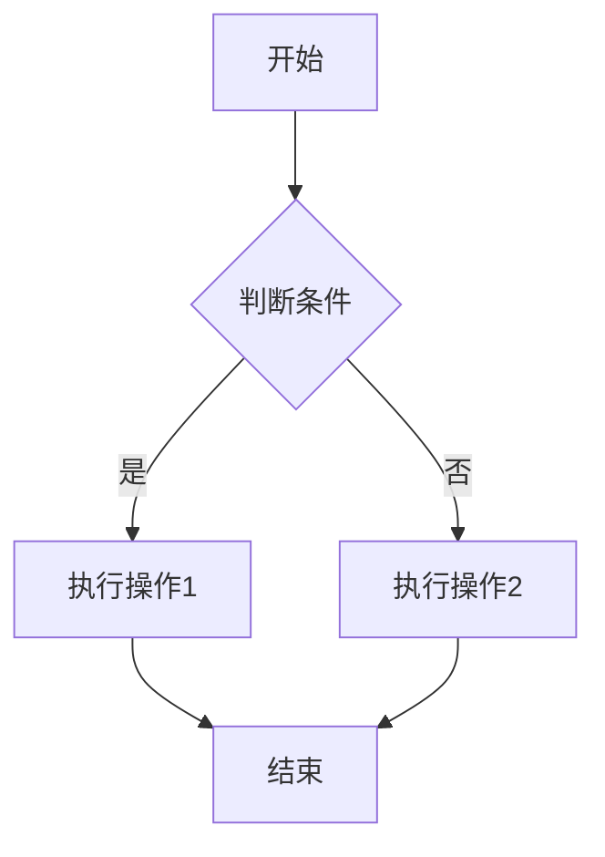

Markdown 是一种轻量级标记语言，它让您可以使用简单的语法来格式化文本。本指南将帮助您掌握 Markdown 的所有功能。

## 目录

## 什么是 Markdown？

Markdown 是由 John Gruber 在 2004 年创建的一种轻量级标记语言。它的设计目标是：

- **易读易写** - 即使在纯文本形式下也很容易阅读
- **简单高效** - 用简单的语法实现复杂的格式
- **广泛支持** - 几乎所有现代编辑器都支持
- **平台无关** - 可以在任何操作系统上使用

## 基础语法

### 标题

使用 `#` 号创建标题，数量表示标题级别：

```markdown
# 一级标题
## 二级标题
### 三级标题
#### 四级标题
##### 五级标题
###### 六级标题
```

**效果预览：**

# 一级标题
## 二级标题
### 三级标题

### 段落和换行

段落之间用空行分隔：

```markdown
这是第一个段落。

这是第二个段落。
```

行末加两个空格可以创建软换行：

```markdown
第一行  
第二行（软换行）
```

### 文本强调

```markdown
*斜体文本* 或 _斜体文本_
**粗体文本** 或 __粗体文本__
***粗斜体文本*** 或 ___粗斜体文本___
~~删除线文本~~
```

**效果：**
- *斜体文本*
- **粗体文本**
- ***粗斜体文本***
- ~~删除线文本~~

### 列表

#### 无序列表

```markdown
- 项目1
- 项目2
  - 子项目1
  - 子项目2
- 项目3

* 也可以使用星号
+ 或者加号
```

#### 有序列表

```markdown
1. 第一项
2. 第二项
   1. 子项目1
   2. 子项目2
3. 第三项
```

#### 任务列表

```markdown
- [x] 已完成的任务
- [ ] 未完成的任务
- [ ] 另一个未完成的任务
```

### 链接

```markdown
[链接文本](https://example.com)
[带标题的链接](https://example.com "这是链接标题")

<https://example.com> <!-- 自动链接 -->

[参考链接][1]
[1]: https://example.com "参考链接标题"
```

### 图片

```markdown


[](https://example.com)
```

### 引用

```markdown
> 这是一个引用
> 
> 引用可以包含**格式化文本**

> 多级引用
>> 第二级引用
>>> 第三级引用
```

**效果：**
> 这是一个引用
> 
> 引用可以包含**格式化文本**

## 代码

### 行内代码

```markdown
这里有一个 `inline code` 示例
```

### 代码块

使用三个反引号创建代码块：

````markdown
```
普通代码块
```

```javascript
// 带语法高亮的代码块
function hello() {
  console.log("Hello World!");
}
```
````

### 常用编程语言标识

```
html, css, javascript, typescript, python, java, 
php, ruby, go, rust, swift, kotlin, dart, 
json, yaml, xml, sql, bash, shell, powershell
```

## 表格

```markdown
| 左对齐 | 居中对齐 | 右对齐 |
|:-------|:--------:|-------:|
| 内容1  | 内容2    | 内容3  |
| 长内容 | 短内容   | 中等内容 |
```

**效果：**

| 左对齐 | 居中对齐 | 右对齐 |
|:-------|:--------:|-------:|
| 内容1  | 内容2    | 内容3  |
| 长内容 | 短内容   | 中等内容 |

## 高级语法

### 水平分割线

```markdown
---
***
___
```

### 转义字符

使用反斜杠转义特殊字符：

```markdown
\*不是斜体\*
\[不是链接\]
\# 不是标题
```

### HTML 支持

Markdown 支持内联 HTML：

```html
<div style="color: red;">
  这是红色文字
</div>

<details>
  <summary>点击展开</summary>
  这里是隐藏的内容
</details>
```

## 扩展语法

### 脚注

```markdown
这里有一个脚注[^1]。

[^1]: 这是脚注的内容。
```

### 定义列表

```markdown
Term 1
: Definition 1

Term 2
: Definition 2a
: Definition 2b
```

### 数学公式（LaTeX）

```markdown
行内公式：$E = mc^2$

块级公式：
$$
\int_{-\infty}^{\infty} e^{-x^2} dx = \sqrt{\pi}
$$
```

### 图表（Mermaid）

```markdown

```

## 写作最佳实践

### 文档结构

1. **使用一致的标题层次**
   ```markdown
   # 文档标题
   ## 主要章节
   ### 子章节
   #### 详细说明
   ```

2. **添加目录**
   ```markdown
   ## 目录
   - [第一章](#第一章)
   - [第二章](#第二章)
     - [子章节](#子章节)
   ```

3. **使用适当的列表**
   - 步骤说明使用有序列表
   - 要点罗列使用无序列表
   - 检查清单使用任务列表

### 代码文档

1. **提供语言标识**
   ````markdown
   ```javascript
   // 而不是
   ```
   ````

2. **添加注释说明**
   ```javascript
   // 创建一个新用户
   function createUser(name, email) {
     // 验证输入
     if (!name || !email) {
       throw new Error('姓名和邮箱都是必需的');
     }
     
     // 返回用户对象
     return { name, email, id: Date.now() };
   }
   ```

3. **使用有意义的示例**
   ```javascript
   // 好的示例 - 实际应用场景
   const users = [
     { name: '张三', age: 25 },
     { name: '李四', age: 30 }
   ];
   
   // 差的示例 - 无意义的变量名
   const a = [
     { b: 'foo', c: 1 },
     { b: 'bar', c: 2 }
   ];
   ```

### 链接和引用

1. **使用描述性链接文本**
   ```markdown
   ✅ 查看 [Markdown 官方规范](https://commonmark.org/)
   ❌ 点击 [这里](https://commonmark.org/)
   ```

2. **检查链接有效性**
   - 定期检查外部链接
   - 使用相对路径引用内部资源

3. **提供上下文**
   ```markdown
   根据 [W3C 的无障碍指南](https://www.w3.org/WAI/WCAG21/Understanding/) 的建议，
   我们应该为所有图片添加替代文本。
   ```

### 图片优化

1. **提供有意义的替代文本**
   ```markdown
   
   ```

2. **控制图片尺寸**
   ```html
   
   ```

3. **使用合适的格式**
   - 照片：JPEG 或 WebP
   - 图标：SVG 或 PNG
   - 截图：PNG

## 常用工具推荐

### 编辑器

1. **专业编辑器**
   - [Typora](https://typora.io/) - 所见即所得
   - [Mark Text](https://github.com/marktext/marktext) - 开源免费
   - [Obsidian](https://obsidian.md/) - 知识管理

2. **在线编辑器**
   - [StackEdit](https://stackedit.io/) - 功能强大
   - [Dillinger](https://dillinger.io/) - 简洁易用
   - [HackMD](https://hackmd.io/) - 协作编辑

3. **IDE 插件**
   - VS Code：Markdown All in One
   - Vim：vim-markdown
   - Emacs：markdown-mode

### 辅助工具

1. **表格生成器**
   - [Tables Generator](https://www.tablesgenerator.com/markdown_tables)
   - [Markdown Tables](https://markdowntables.com/)

2. **图片工具**
   - [TinyPNG](https://tinypng.com/) - 图片压缩
   - [Unsplash](https://unsplash.com/) - 免费图片

3. **语法检查**
   - [Grammarly](https://www.grammarly.com/) - 英文语法
   - [秘塔写作猫](https://xiezuocat.com/) - 中文写作

## 调试和故障排除

### 常见问题

1. **列表不显示**
   ```markdown
   ❌ 错误：没有空行
   前面的文字
   - 列表项
   
   ✅ 正确：有空行
   前面的文字
   
   - 列表项
   ```

2. **代码块不高亮**
   ````markdown
   ❌ 错误：语言标识错误
   ```java script
   
   ✅ 正确：使用正确标识
   ```javascript
   ````

3. **链接不工作**
   ```markdown
   ❌ 错误：空格或特殊字符
   [链接](file name.md)
   
   ✅ 正确：使用URL编码
   [链接](file%20name.md)
   ```

### 调试技巧

1. **使用预览功能**
   - 实时预览检查格式
   - 对比源码和渲染结果

2. **逐段检查**
   - 注释掉可疑部分
   - 逐一恢复定位问题

3. **验证语法**
   - 使用在线验证工具
   - 检查特殊字符转义

## 总结

Markdown 是现代写作的必备技能。通过掌握这些语法和最佳实践，您可以：

- 📝 **高效写作** - 专注内容而非格式
- 🔄 **跨平台兼容** - 一次编写，到处使用  
- 📚 **版本控制友好** - 与Git完美配合
- 🎯 **简洁清晰** - 结构化的文档组织

继续练习和应用这些技巧，您将成为 Markdown 写作专家！

## 进一步学习

- [CommonMark 规范](https://commonmark.org/)
- [GitHub Flavored Markdown](https://github.github.com/gfm/)
- [Markdown Guide](https://www.markdownguide.org/)
- [Learn Markdown](https://www.markdowntutorial.com/)
